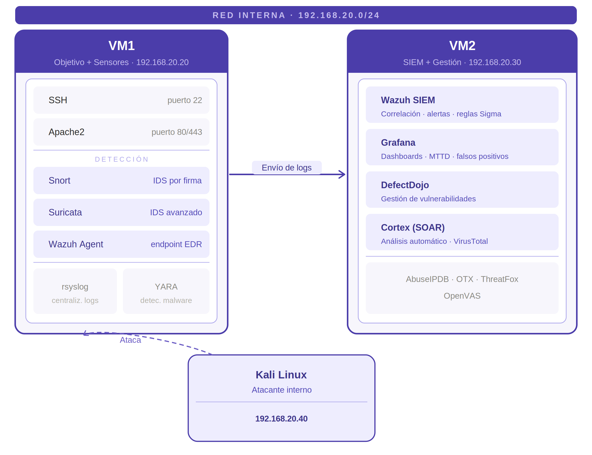

# 🛡️ SentinelLab — Mini-SOC de Detección y Respuesta

Entorno casero de monitorización de seguridad construido sobre **2 máquinas virtuales**, alineado con el certificado **"Optimización y Gestión de la Monitorización de Seguridad"** de OpenWebinars.

> 🚧 **Proyecto en progreso** — este README se actualiza a medida que se completa cada bloque.

---

## 🎯 Objetivo del Proyecto

Demostrar de forma práctica un **ciclo completo de monitorización de seguridad**:

- ✅ Centralización de logs (Syslog)
- ✅ Detección activa en red y endpoint (Snort, Suricata, Wazuh)
- ⏳ Correlación en SIEM (Wazuh Server + Grafana)
- ⏳ Enriquecimiento con Threat Intelligence (AbuseIPDB, OTX, ThreatFox)
- ⏳ Gestión de vulnerabilidades (OpenVAS + DefectDojo)
- ⏳ Detection as Code (Versionado de reglas + CI/CD)

---

## 🏗️ Arquitectura del Entorno

### Diagrama de Red

  
   
  <em>Diagrama de arquitectura del entorno SentinelLab</em>

## 👤 Autor

**Ángel Castaño Arias**
Técnico en Administración de Sistemas Informáticos en Red · Cisco CCNA · Ethical Hacker · Network Security
[LinkedIn](http://www.linkedin.com/in/ángel-castaño-arias-8242b8342) · [GitHub](https://github.com/AngelCasta1)
